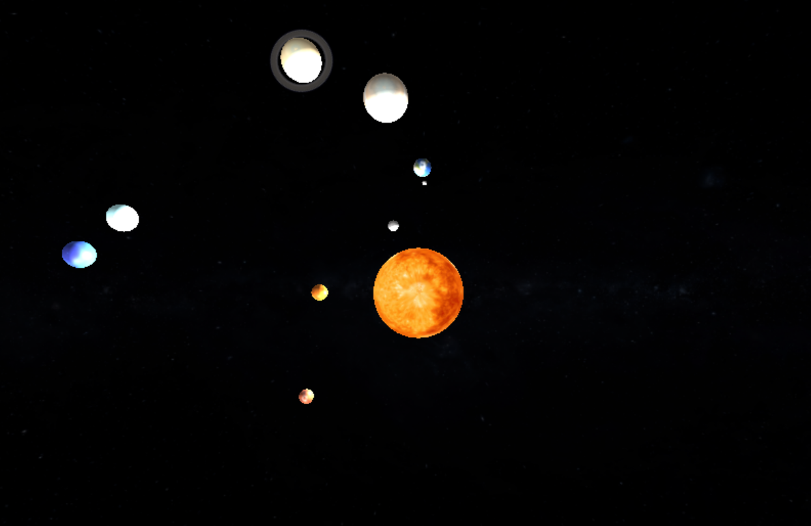

# Projeto Sistema Solar

Projeto de Visualização do Sistema Solar em 3D, interativo e em tempo real, desenvolvido com a biblioteca Three.js para a disciplina de **Computação Gráfica (2025.1)**.

 - Link para Visualização no Youtube
  ``` (https://youtu.be/6sJGrojS5iY) ```
- Link do Deploy
  ``` (https://analara714.github.io/sistema-solar/) ```

## Pré-visualização

<p align="center">
  
</p>

## Funcionalidades

- Visualização 3D dos principais planetas do Sistema Solar.
- Animação da translação dos planetas ao redor do Sol em suas respectivas órbitas.
- Animação da rotação dos planetas em seus próprios eixos.
- Controles de câmera interativos para explorar o cenário:
    - **Zoom:** Aproxime e afaste a visão.
    - **Rotação/Órbita:** Gire a câmera ao redor de um ponto de foco.
    - **Velocidade:** Altere a velocidade de rotação dos planetas.
- Fonte de luz centralizada no Sol para simular a iluminação dos corpos celestes.
- Texturas realistas aplicadas às superfícies dos planetas.

## Tecnologias Utilizadas

Este projeto foi construído utilizando as seguintes tecnologias:

- **HTML5:** Estrutura base da página.
- **CSS3:** Estilização e layout.
- **JavaScript (ES6+):** Lógica principal da aplicação.
- **Three.js:** Biblioteca para criação e renderização de gráficos 3D (WebGL).

## Como executar o projeto localmente

Para executar este projeto, você precisará de um navegador de internet moderno e de um servidor web local, pois o carregamento de texturas e módulos 3D é bloqueado por políticas de segurança do navegador (CORS) quando aberto diretamente do arquivo.

**1. Clone o repositório:**
```markdown
git clone [https://github.com/Analara714/sistema-solar.git]
```

**2. Navegue até a pasta do projeto:**
```bash
cd sistema-solar
```
**3. Inicie um servidor local usando a extensão "Live Server" no VS Code:**
  - Instale a extensão Live Server no seu VS Code.
  - Com a pasta do projeto aberta, clique com o botão direito no arquivo index.html.
  - Selecione "Open with Live Server".
  - O navegador abrirá automaticamente com o projeto em execução.

## Controles

- **Rotacionar a Câmera:** Clique e arraste com o botão esquerdo do mouse.
- **Zoom:** Use a roda de rolagem (scroll) do mouse.
- **Mover a Câmera (Pan):** Clique e arraste com o botão direito do mouse.
- **Aumentar velocidade:** Seta para cima.
- **Diminuir velocidade:** Seta para baixo.

## Autores

Desenvolvido por:

- Ana Lara Carvalho Mesquita - 498866
- Bianka Aparecida de Carvalho - 537278
- Eric da Costa Evaristo - 499158
- Marina Paula Fontenele - 539022
- Pedro Eric Carneiro - 538121
- Pricila Aquila Araujo - 499464
